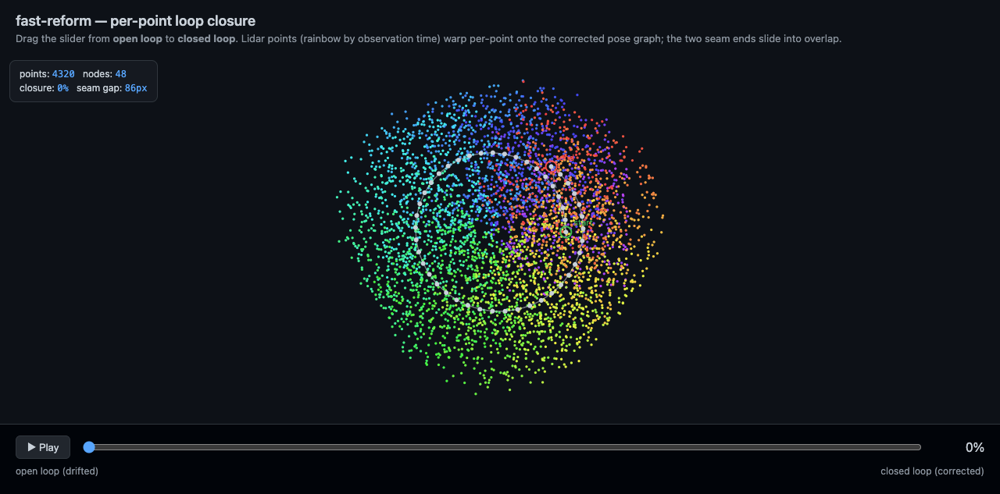
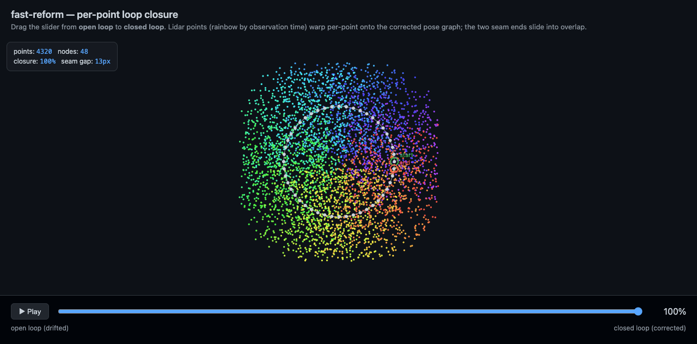
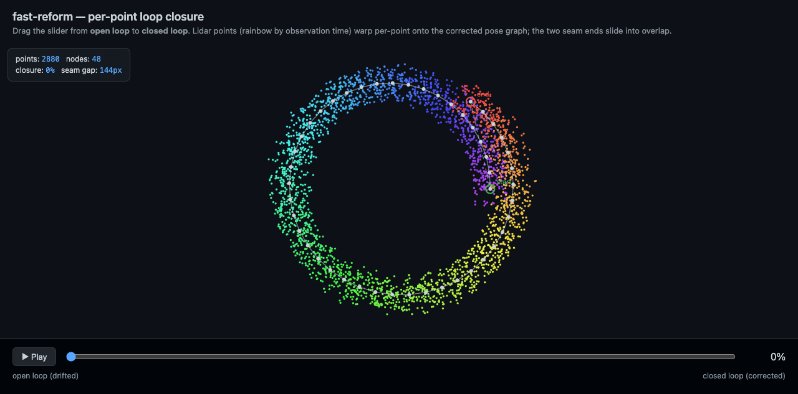
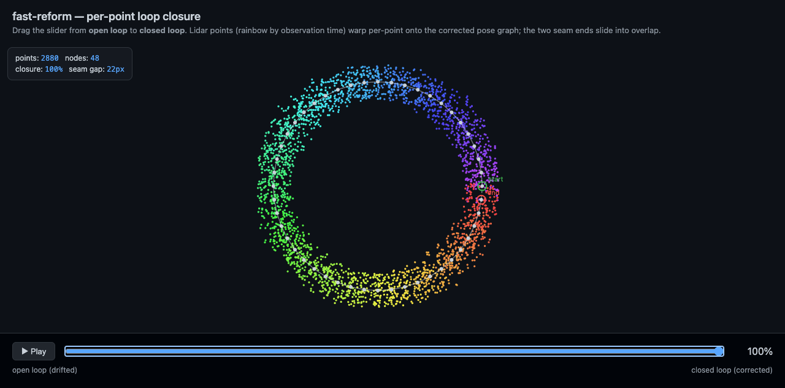

# fast-reform

Fast **per-point loop-closure warp** for point clouds — a Rust reimplementation
of jnav's `apply_closure`.

When a SLAM system detects a loop closure, pose-graph optimization (PGO) retro-
actively corrects every keyframe pose to remove accumulated drift. But the global
map — millions of accumulated lidar points — was built against the *old*, drifted
poses. `fast-reform` propagates the pose corrections onto those points so the map
stays consistent, correcting **each point by the pose-graph state at the moment it
was observed**.

|  open loop (drifted)  |  closed loop (corrected)  |
| :-------------------: | :-----------------------: |
|  |  |

Drag the demo slider from 0% to 100% and the drifted cloud warps, per point, onto
the corrected pose graph. Points are colored by observation time (rainbow), so you
can watch the timeline untwist.

## The idea

A robot drives a loop. Odometry drifts, so its estimated trajectory is a spiral
that never quite meets itself — the two ends of the loop don't line up:

|  thin lidar ring, open  |  thin lidar ring, closed  |
| :---------------------: | :-----------------------: |
|  |  |

The green marker is the loop's start, the red marker its end. Before closure they
sit far apart (the drift gap). PGO produces one SE(3) correction per keyframe;
applying those corrections closes the gap and the two ends slide into overlap.

The trick is that a point observed early (small drift) should barely move, while a
point observed late (large accumulated drift) needs a big correction. Binding each
point to its observation timestamp is what makes that work.

## How the warp works

Inputs:

- **`PointCloud2`** — XYZ positions plus optional per-point observation
  `timestamps` (and intensities / frame metadata carried through untouched).
- **`GraphDelta3D`** — the PGO correction: a list of keyframe `nodes` (each with a
  timestamp) paired with the SE(3) `transforms` iSAM2 applied to them
  (`post = delta · pre`, world-frame left-multiply, quaternion `(x, y, z, w)`).

For every point, the correction is a **proximity-weighted blend** of the node
deltas — weighted by closeness in *both space and time*:

1. **Weigh every node.** For node `i`, weight
   `w_i = exp(-d² / 2σ²) · exp(-Δt² / 2σ_t²)`, where `d` is the distance from the
   point to the node's anchor position and `Δt` is the gap between the point's
   observation time and the node's time.
2. **Blend a correction.** Normalize the weights and average the node deltas —
   [`nlerp`](src/math.rs)-style weighted quaternion average on rotation, weighted
   mean on translation.
3. **Apply it rigidly.** `warped = rotation · point + translation`.

Why both terms:

- The **spatial** term makes the correction a smooth function of *position*, so
  neighboring points get near-identical corrections. The warp is therefore
  **locally space-preserving** — nearby points keep their relative arrangement and
  the cloud does not fold over itself.
- The **time** term disambiguates a loop **seam**. Where the drifted trajectory
  crosses back over itself, two segments occupy the same space but need opposite
  corrections; spatial distance alone would average them (closing nothing), so the
  time term keeps each point bound to the segment it was actually observed on.

Points with no timestamp fall back to a spatial-only blend. A point far from every
node falls back to its nearest node's rigid delta. Empty cloud or empty correction
is a pass-through.

The per-point loop is embarrassingly parallel and runs on
[rayon](https://docs.rs/rayon) on native targets; the wasm build uses a serial
loop.

## Thinning a dense pose graph

A real pose graph can carry far more keyframes than the warp needs — neighboring
nodes often hold nearly the same delta, so the blend would reconstruct a dropped
node's correction from its neighbors anyway. [`sparsify`](src/sparsify.rs) thins a
correction down to a target node count with **greedy leave-one-out decimation**:

```rust
use fast_reform::sparsify;

let thinned = sparsify(&graph_delta, 12); // keep the 12 least-redundant nodes
```

Repeatedly, for every remaining node it measures how far off the *other* nodes are
when they blend to reconstruct that node's own delta (applied at the node's
anchor), then drops the node with the smallest error — the most redundant one —
until `target_nodes` remain. Bandwidths are re-derived from the shrinking set each
round so the error uses the same blend the final sparse graph will. Nodes are
treated as an unordered set, so this also works for multi-robot graphs with no
single keyframe sequence. In the demo, thinning 48 nodes down to ~10 still closes
the loop to a ~4px seam gap.

### How this differs from the original `apply_closure.py`

| aspect | Python original | fast-reform |
| --- | --- | --- |
| granularity | quantizes points into `time_step_s` buckets, one blend per bucket | **per-point** — every point corrected individually |
| correction field | keyed by time only (bucket) | **space + time** proximity blend — locally non-folding, seam-aware |
| rotation blend | true SLERP | **nlerp** (normalized lerp — cheaper, negligible error for small deltas) |
| parallelism | numpy vectorized | **rayon** on native, serial on wasm |

## Library usage

```rust
use fast_reform::{apply_closure_to_cloud, PointCloud2, GraphDelta3D};

let warped: PointCloud2 = apply_closure_to_cloud(&cloud, &graph_delta);
```

`apply_closure_to_cloud` rebuilds the blend arrays (normalized rotations, node
anchors/times, resolved bandwidths) on every call. When you apply the same
correction to many clouds — or re-warp a live map as points stream in — hold a
[`Reformer`](src/reform.rs) instead: it owns the correction and caches those
arrays, rebuilding only when the correction changes.

```rust
use fast_reform::Reformer;

let mut reformer = Reformer::new(graph_delta);
let warped = reformer.apply(&cloud);   // uses the cached blend

reformer.sparsify(12);                  // thin, cache rebuilt once
reformer.set_delta(next_delta);         // PGO update, cache rebuilt once
let warped_again = reformer.apply(&cloud);
```

Key modules:

- [`src/warp.rs`](src/warp.rs) — `apply_closure_to_cloud`, the per-point warp, and
  the bracket-and-extrapolate blend.
- [`src/math.rs`](src/math.rs) — `Vec3`, `Quat`, `nlerp`, quaternion rotation.
- [`src/graph.rs`](src/graph.rs) — `GraphDelta3D`, `Transform`, and `.scaled(alpha)`
  (used by the demo to sweep a correction from identity to full).
- [`src/point_cloud.rs`](src/point_cloud.rs) — `PointCloud2`.
- [`src/synthetic.rs`](src/synthetic.rs) — `generate_scene(&LoopParams)` builds a
  drifted loop and its exact closure correction (deterministic, no `rand` dep).

## Building & running

```bash
./run/build     # compile the native lib + wasm, stage web/fast_reform.wasm
./run/web        # rebuild wasm, serve web/, open the demo in your browser
cargo test       # run the suite (12 tests)
```

Both `run/*` scripts are Deno + [dax](https://github.com/dsherret/dax). The wasm
build needs the target once: `rustup target add wasm32-unknown-unknown`.

## The web demo

[`web/`](web/) is a no-build, plain-JS + canvas demo. It loads the wasm module
directly (raw C-ABI, no wasm-bindgen — JS reads flat `f32` arrays straight out of
linear memory) and renders:

- the **lidar points**, rainbow-colored by observation time,
- the **pose graph** (nodes + edges, with a dashed closing edge),
- **start/end markers** so you can watch the seam overlap,
- a **closure slider** (and ▶Play) that scales the correction from 0% (open loop)
  to 100% (closed loop) in real time,
- a **nodes slider** that thins the pose graph from all keyframes down to a
  handful (via `sparsify`) so you can watch the loop still close with far fewer
  nodes.

The demo scene uses a deliberately wide sensor spread so points fill the whole disk
— that way you can see how points in the *middle* of the loop warp, not just a thin
ring.

## License

Apache-2.0 (matching the upstream jnav source).
